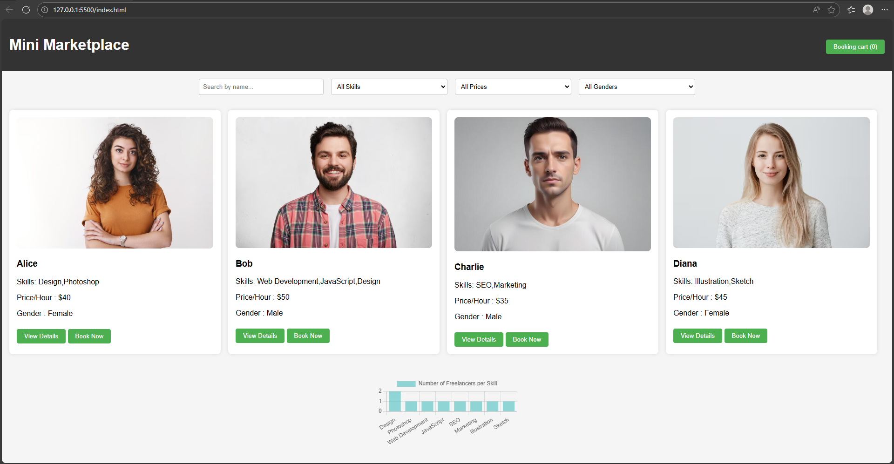

# Mini Marketplace / Service Booking Platform

A JavaScript-powered freelance marketplace platform that allows users to browse, search, filter, and book services from various freelancers. This project showcases practical front-end development skills, interactive UI, and real-world application functionality.

---

## ✨ Features
- Browse freelancers with profile details, services, and pricing
- Advanced search and filtering by service type, price, and freelancer attributes
- Booking workflow for selecting and requesting services
- Local storage management for user interactions
- Responsive and modern UI design
- Interactive charts for analytics (Chart.js)
- Detailed individual freelancer profile pages
  
---

## 🛠️ Tech Stack
- HTML5
- CSS3
- JavaScript (ES6+)
- Fetch API (for data simulation)
- LocalStorage
- Chart.js

---

## 🚀 How to Run
1. Clone the repository
2. Open `index.html` in your browser
3. Navigate through the platform and test features

---

## 🎯 Purpose of This Project
This project demonstrates the ability to build a fully functional, interactive marketplace using only JavaScript, HTML, and CSS. It emphasizes:
- Handling complex UI interactions
- Implementing search, filter, and booking logic
- Designing a responsive and user-friendly interface
- Writing maintainable and scalable code

It also serves as a strong portfolio piece to showcase expertise in **front-end development** and real-world application building.

---

## 📩 Feedback
If you have any suggestions, improvements, or feedback, feel free to open an issue or submit a pull request.
